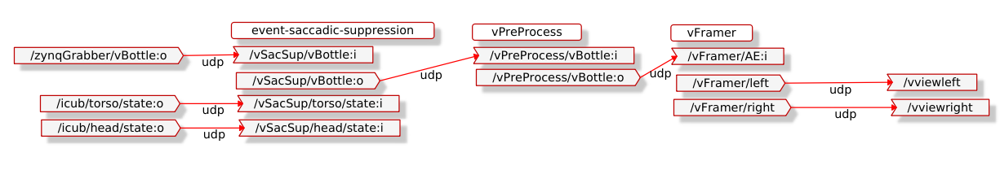
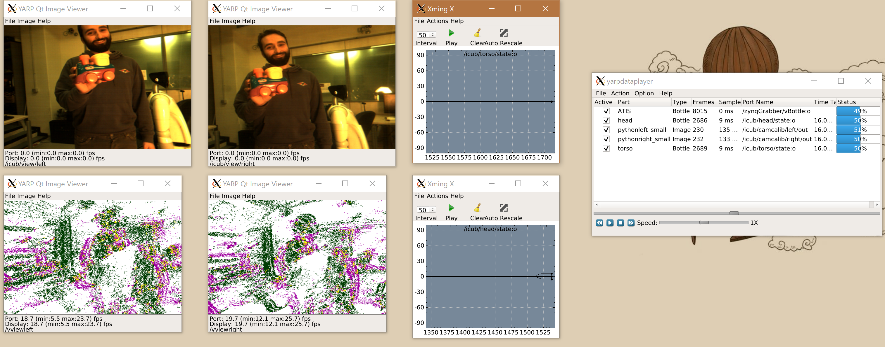

# Event-driven Saccadic Suppression

The human brain ignores a lot of the visual signal from the eyes during the eye saccade motion; when a fast movement to a new focal point is made. This is done as the brain is unable to process the large amount of visual change that occurs in a very short period of time. In this assignment we will implement a crude version of saccadic suppression by blocking the event-stream when any movement of the iCub is made that moves the eyes, from the torso, head or eyes. 

### Prerequisites
By now, you should have learnt about Saccadic Suppression, and have completed the tutorials on event-driven processing in YARP.

## Assignment
You will have to complete a module that reads the encoders of the icub, and the event-stream from the event-cameras. The velocity of each joint will need to be calculated to determine if the icub is undergoing motion. If the absolute velocity of either the torso or the head is beyond a threshold, the event-stream should be blocked. We therefore achieve a basic succadic suppression, in which the visual signal is only present when the icub is still._Note: a more correct saccadic suppression might only block the visual signal for very high speed saccades, however in this simple module, we will block for *all* motion_

To accomplish this task you have to modify the code already present in this assignment and **fill in the missing gaps** highlighted by the comment `// FILL IN THE CODE`, to:

1. Open ports to read the robot encoders
1. Calculate the encoder velocity from multiple encoder readings
1. Allow or block the event-stream depending on the velocity readings

The module will function as a gate between the event-source (``/zynqGrabber/vBottle:o``) and event-driven processing and visualisation modules. You should be able to visualise the suppressed stream in yarpview by using ``vFramer`` as covered in the [first tutorial](https://github.com/vvv-school/tutorial_event-driven-framework), by using the _yarpmanager script_ provided from within [**app/scripts**](./app/scripts/).

The events due to the camera motion, which can still be seen in the image below, should be blocked in the final application, and won't be seen in the visualisation of the event-stream.

## Testing
Event-driven datasets can be found at `$ROBOT_CODE/datasets/VVV-eventdriven` in the provided virtual machine, and instructions for getting the datasets and uncompressing them can be found [here](https://github.com/vvv-school/vvv18/wiki/How-to-prepare-your-system#download-datasets). Three datasets are available to use for testing and can be loaded into the `yarpdatapayer` by opening `VVV-eventdriven/1`, `VVV-eventdriven/2`, or `VVV-eventdriven/3` in the `yarpdataplayer` loading GUI. The datasets contain the event-stream, the torso and head encoder values and the standard camera frames for comparison. 

Once you are happy your saccadic suppression is working, you can test your code **Automatically**: [running the script **test.sh**](https://github.com/vvv-school/vvv-school.github.io/blob/master/instructions/how-to-run-smoke-tests.md) in the **smoke-test** directory. The smoke test will give a maximum of 6 marks.

## Hints and Tips
- The ports ``/icub/torso/state:o`` and ``/icub/head/state:o`` publish the encoder values while there is a valid _yarprobotinterface_ running. For the dataset we have recorded these ports along with the visual stimulus.
- The _icub-main_ repository contains a linear estimator that can be used to fit a line to the encoder values. The slope of the line gives an estimate of the velocity. More information is available [here](http://wiki.icub.org/brain/classiCub_1_1ctrl_1_1AWLinEstimator.html). Have a look at: 
  *  `void AWPolyEstimator::feedData	(	const AWPolyElement & 	el	)` 
  *  `AWPolyElement (const yarp::sig::Vector &d, const double t)`
  *  `Vector AWPolyEstimator::estimate	(		)` 
  *  `double yarp::math::norm(const yarp::sig::Vector &)` 
- As the module is only acting as a gate, the actual content of the event stream do not need to be read. Therefore the input bottle can simply be copied to the output bottle if the iCub is deemed stationary.
- To change the value of any default parameter for the smoke test, you will need to do it within the code so it compiles with the new value. Change the default value as read by the configure function.

### [How to complete the assignment](https://github.com/vvv-school/vvv-school.github.io/blob/master/instructions/how-to-complete-assignments.md)
